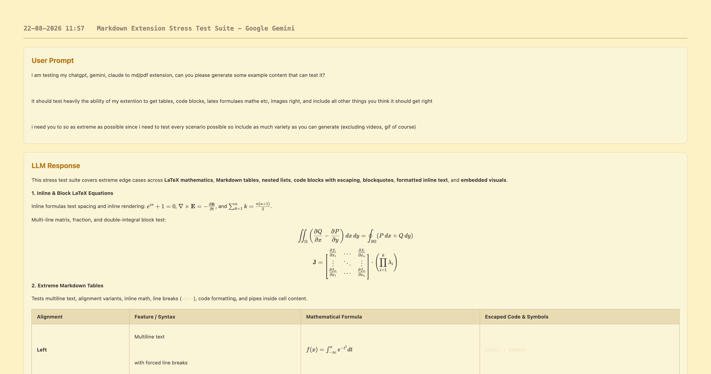
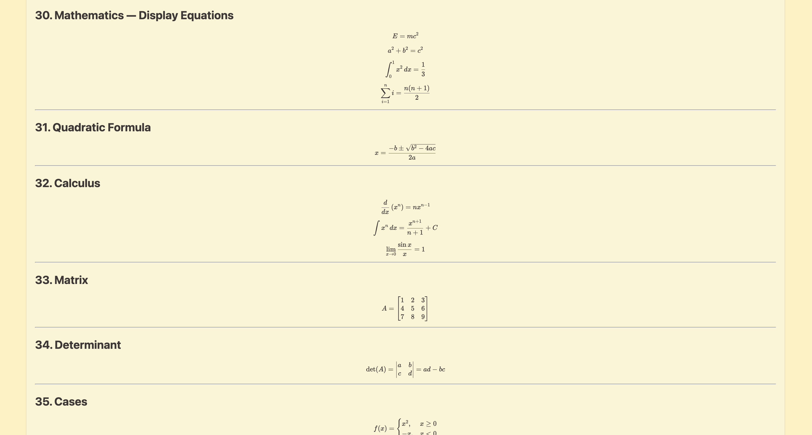
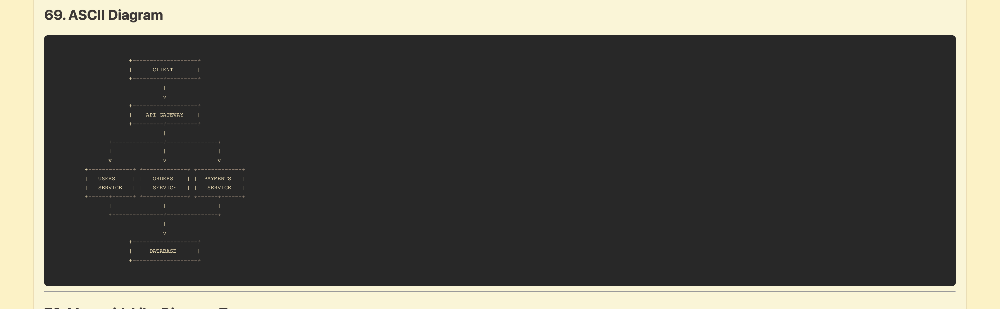
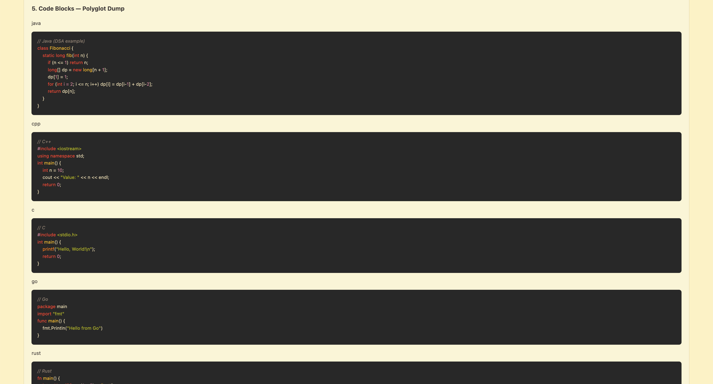

# Chat-a-logue 📜

Got tired of limited exports on other free extensions so built one to export ChatGPT, Claude, and Gemini chats to beautifully formatted Markdown or styled PDFs.

I build this mainly for exporting my chats with heavy LaTeX and Mathe content. GruvBox-themed PDFs look best imo, but there's also option to use light and dark themed PDFs.

## ✨ Features

- **Multi AI Support:** Works flawlessly across ChatGPT, Claude, and Google Gemini.
- **Resilient DOM Scraping:** Uses custom web components and data attributes instead of fragile CSS classes, ensuring the extension doesn't break when platforms update their UI.
- **Flawless Math & Code:** Extracts raw LaTeX from MathML/MathJax to prevent formatting destruction, and utilizes a locally bundled Highlight.js engine to colorize code blocks entirely offline.
- **Base64 Image Conversion:** Automatically fetches and converts blob images to Base64 so exported PDFs and Markdown files retain their visuals.
- **Context Loss Prevention:** Automatically reinjects content scripts on the fly if the browser context invalidates, meaning you never have to manually refresh your tab.
- **Dynamic Theming:** Export your chats in Light, Dark, or Gruvbox themed PDF or Markdown files[cite: 1].

## 📸 See It In Action

Check out the screenshots below to see how Chat-a-logue handles complex layouts, math, ASCII diagrams, and syntax highlighting:
### 1. Layout

### 2. Math

### 3. ASCII

### 4. Syntax Highlighting

### 📄 View Full Export Examples

Want to see exactly what the final output looks like? [Click here to view detailed PDF and Markdown export samples](examples).

## 🚀 Installation

_(Instructions on how to install via Chrome Web Store or unpack locally will go here!)_
